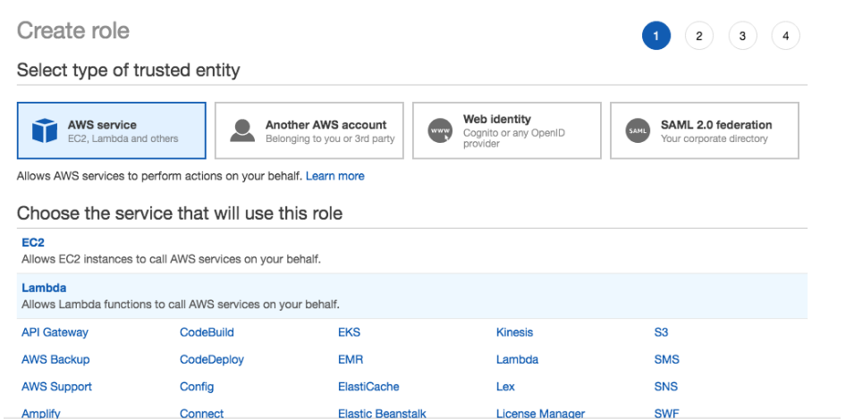
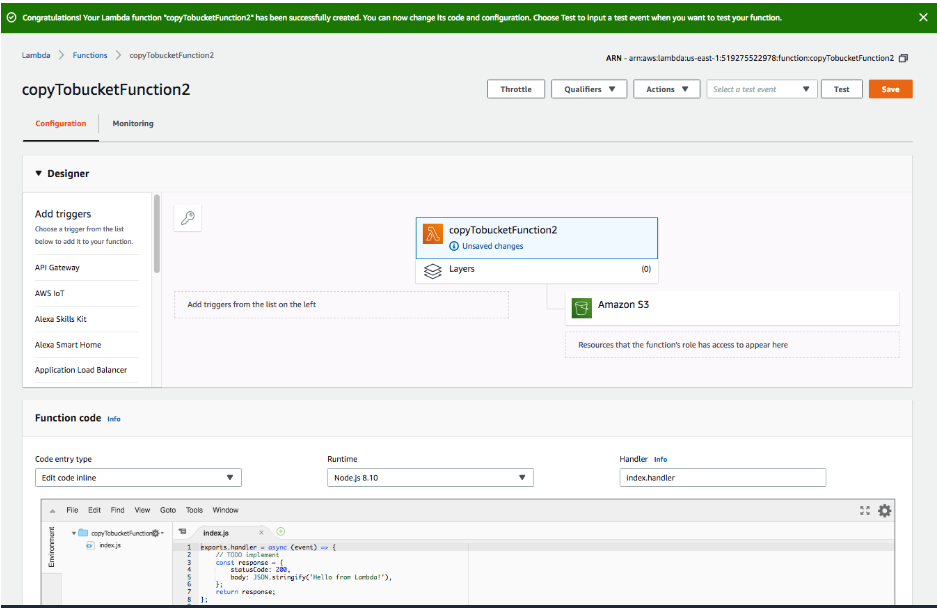
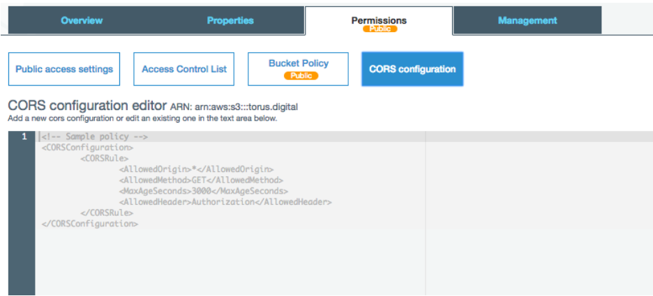
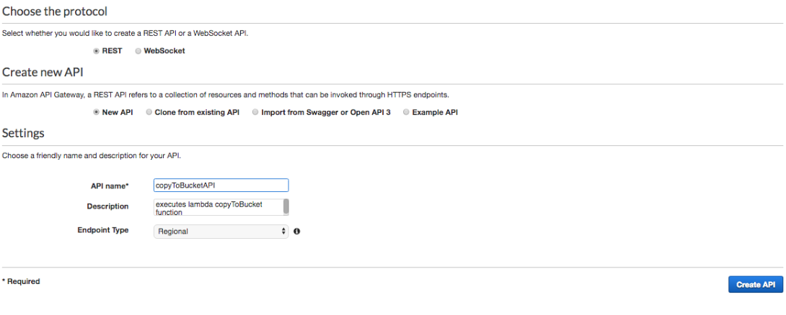
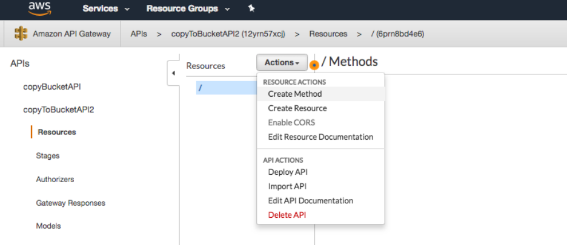
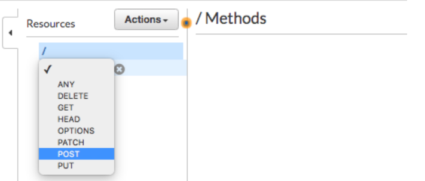
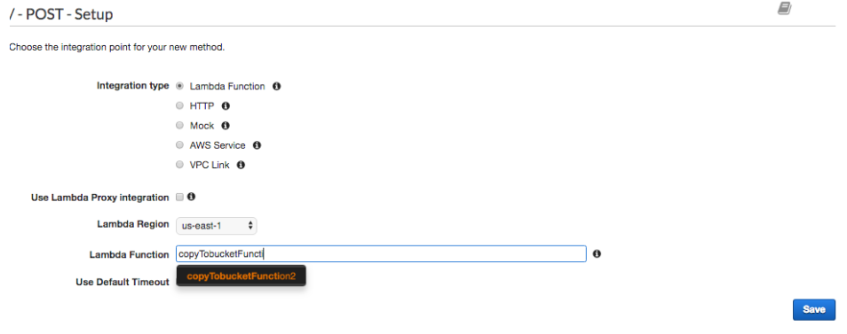
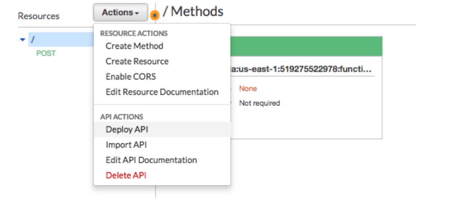
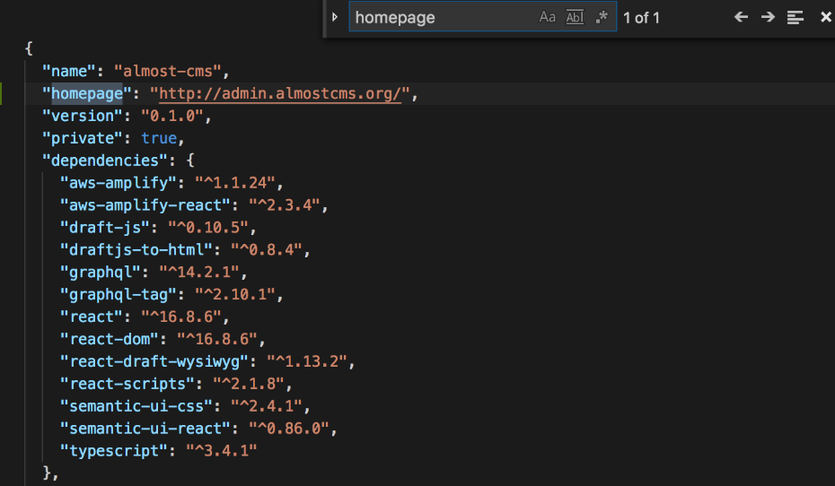

**Getting Started with almost CMS**

The deployments script is coming soon and it will make the installation A LOT shorter!

      1. prerequisites
      2. Clone github repo
      3. Install amplify
      4. Install the amplify CLI
      5. Configure amplify
      6. Init amplify
      7. Add authentication
      8. Add Storage
      9. Add API 
      10. Push Amplify Changes
      11. Create a public bucket and host your static site
      12. Copy to Bucket Function
          1. Create i am policy
          2. Deploy the lambda function
          3. Deploy the api
          4. Add the API route in your app
      13. Deploy Amplify
    
1. ** Prerequisites **
    1. Make sure you have node.js and npm installed. You can checkout this [tutorial](https://medium.com/@lucaskay/install-node-and-npm-using-nvm-in-mac-or-linux-ubuntu-f0c85153e173) to install npm and node in mac, linux (debian/ubuntu).
    2. Make sure you have an AWS account. If you don't have an AWS account, you can easily create one [here](https://aws.amazon.com/). Don't worry, everything you do with this project will fall within the AWS free tier limit! if you deploy to production, you'll have a tiny bill of perhaps a dollar a month! 
2. Clone the git repository
3. Go into the app directory of the project ` cd almost_cms/almost_cms `
4. Install all dependencies by running ` npm install`
5. Make sure that amplify installed correctly by running ` amplify `
    - In case amplify didnt install, you can run:
    1. ` npm install aws-amplify aws-amplify-react` 
    2.  ` npm install -g @aws-amplify/cli`
6. Configure amplify by running ` amplify configure `
    - The following short video [tutorial](https://www.youtube.com/watch?v=fWbM5DLh25U) will help you with the configuration
7. Initialize a new amplify project inside your react app ` amplify init `
8. Add authentication ` amplify add auth`

9. Add S3 storage for large files and media objects ' amplify add storage '

10. Add a graphQL API to easily store and retrieve data from dynamoDB ` amplify add api `
When prompted for a schema.graphql file provide the value "schema.graphql" to point to the file which is in the root of the project directory.

11. Run `amplify push` to push changes made into your AWS back end.
12. If you already have a static site hosted in an S3 bucket dismiss this step. Otherwise follow this [tutorial](https://medium.com/@lucaskay/how-to-host-a-static-site-in-an-s3-bucket-with-a-custom-domain-4884fbc887f3) to publish the default template provided in the root of the almost_cms repo into a public S3 bucket.
13. Create the i am policy needed to copy files from your backend storage bucket to your website’s public bucket  **use the same IAM user created when setting up Amplify
    1. Sign in to the AWS console
    2. Go to services -> [IAM](https://console.aws.amazon.com/iam)
    3. On the sidebar, click on Policies and click Create Policy
    4. Click on the JSON tab and paste the policy provided bellow. **Please make sure to change yoursourcebucket and yourdestinationbucket for the names of your respective source and destination buckets.
       
    ```
    {
        "Version": "2012-10-17",
        "Statement": [
            {
                "Sid": "ListSourceAndDestinationBuckets",
                "Effect": "Allow",
                "Action": [
                    "s3:ListBucket",
                    "s3:ListBucketVersions"
                ],
                "Resource": [
                "arn:aws:s3:::yoursourcebucket",
                    "arn:aws:s3:::yourdestinationbucket.com"
                ]
            },
            {
                "Sid": "SourceBucketGetObjectAccess",
                "Effect": "Allow",
                "Action": [
                    "s3:GetObject",
                    "s3:GetObjectVersion"
                ],
                "Resource": "arn:aws:s3:::yoursourcebucket/*"
            },
            {
                "Sid": "DestinationBucketPutObjectAccess",
                "Effect": "Allow",
                "Action": [
                    "s3:PutObject"
                ],
                "Resource": "arn:aws:s3:::yourdestinationbucket/*"
            }
        ]
    }
    ```    
    
    5. Click on Review Policy
    6. Give your policy a name and optionally a description.
    7. Click on Create Policy.
    8. Next Create a role to use this policy. Go back to the IAM console home
    9. On the sidebar, click on Roles
    10. Click on Create Role
    11. Under Choose the service that will use this role, select Lambda

    

    12. Click on Next: Permissions
    13. Search for your newly created function
    14. Select the checkbox beside it

    

    15. Click on Next: Tags
    16. Click on Next: Review
    17. Give Your Role a name and optionally a description.
    18. Click on Create Role

14. Now your ready to deploy your lambda copyToBucket function.
    1. In the AWS console, go to Services -> [Lambda](https://console.aws.amazon.com/lambda)
    2. Click on Create Function
    3. Use the Author from scratch option and leave Runtime set to node.js 8.10
    4. Under Permissions, For execution role, select: Use an existing role
    5. For Existing Role. click on the dropdown arrow in the input and select your newly created IAM role.
    6. Click on Create function
    7. You should see a screen like the following
    
    8. Under function code, delete all the default code and paste the code provided in the copyFunction.js file located at the root of the project. **Make sure you replace YOUR-SOURCE-BUCKET and YOUR-DESTINATION-BUCKET with your respective storage and public bucket names. 
    9. Click on Save to save your new Lambda function.


15. Next go to the S3 console, Services-> S3
    1. And go into your destination bucket, click on permissions and click on CORS configuration.

    

    2. Paste in the following CORS policy
 
 ```
 <?xml version="1.0" encoding="UTF-8"?>
<CORSConfiguration xmlns="http://s3.amazonaws.com/doc/2006-03-01/">
<CORSRule>
    <ID>S3CORSRuleId1</ID>
    <AllowedOrigin>*</AllowedOrigin>
    <AllowedMethod>GET</AllowedMethod>
    <AllowedMethod>HEAD</AllowedMethod>
    <AllowedMethod>PUT</AllowedMethod>
    <AllowedMethod>POST</AllowedMethod>
    <AllowedMethod>DELETE</AllowedMethod>
    <MaxAgeSeconds>3000</MaxAgeSeconds>
    <ExposeHeader>x-amz-server-side-encryption</ExposeHeader>
    <ExposeHeader>x-amz-request-id</ExposeHeader>
    <ExposeHeader>x-amz-id-2</ExposeHeader>
    <ExposeHeader>ETag</ExposeHeader>
    <AllowedHeader>*</AllowedHeader>
</CORSRule>
</CORSConfiguration>
```

16. Now your ready to deploy the API that will interact with your copyBucket Lambda function. In the AWS console, go to Services -> [API Gateway](https://console.aws.amazon.com/apigateway)
    1. Click on + Create API

    

    2. Give your API a name, e.g. copyToBucketApi and optionally a description.
    3. Click Create API
    4. Next click on Actions -> Create Method

    

    5. Select POST from the little dropdown menu that will pop up at your resources sidebar.

    

    6. Click on the little check mark

    

    7. Leave the default Lambda function selected for integration type
    8. In Lambda function: type the name of your recently created lambda function
    9. Click save

    

    10. Confirm the Add Permission to Lambda Function pop up.
    11. Your set. Now you can test your function by clicking on test and providing a payload. You should receive a response message and status
    12. Now you are ready to deploy your API. go to Actions -> Deploy API

    

    13. Give your API a name and click Deploy
    14. Your Invoke URL is your API url e.g. the one you need for the next step
 
17. Now go to the almost_cms app directory (almost_cms/almost_cms) and create a file called .env  **Careful, don't create .env files inside the src directory
18. Inside the .env file, insert the following line; make sure to change your-invoke-url for the invoke url from the previous step:

    REACT_APP_COPY_BUCKET_URL=your-invoke-url

19. Your now ready to use your app! You can use it from localhost by going into your almost_cms app directory (almost_cms/almost_cms) and running ` npm start`
20. To deploy your admin app to admin.your-domain.com, follow the next steps. 
    1. Before deploying your amplify app its very important that you set your intended homepage for the app. **Ill be using admin.almostcms.org in this example as my chosen hosting address.
    2. Open up the almost_cms app’s package.json file and search for your “homepage” variable (cmd + f), and change the value so that it matches the homepage address you want for your newly created app.

    

    3. Now you can run ` amplify hosting add ` to configure your resources.
    4. You can choose between a Dev and Production environments. Dev will only deploy your app in an S3 bucket with HTTP; it will not have a cloudFront distribution or HTTPS.
    5. In this example we will be setting up a dev environment to start alpha testing our app.
    6. Now run ` amplify hosting configure ` and again type in the name of your desired hosting address next to hosting bucket name. 

    

    7. You can run this command at any time to modify the configuration of your resources (website , cloudfront, publish, exit).
    
    
    
    8. You are now ready to publish your App! First run ` npm run build ` to build your front-end components
    9. Now Run ` amplify publish ` and click yes

    

    10. Be a bit patient with deployment process and in a bit you should see a new window pop up with your apps homepage!

21. Now your set to publish content from anywhere! Feel free to take a selfie with your phone and directly upload it to your static site!
